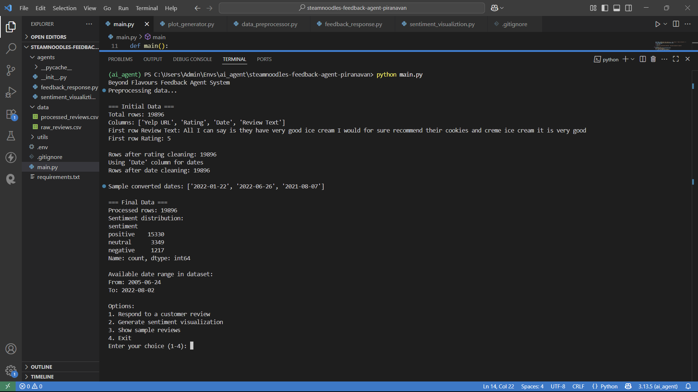
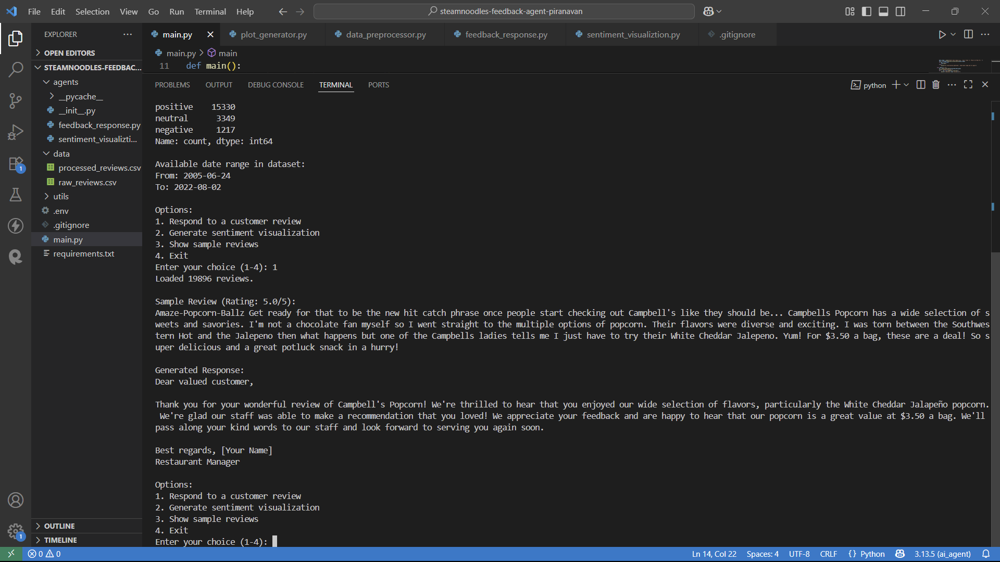
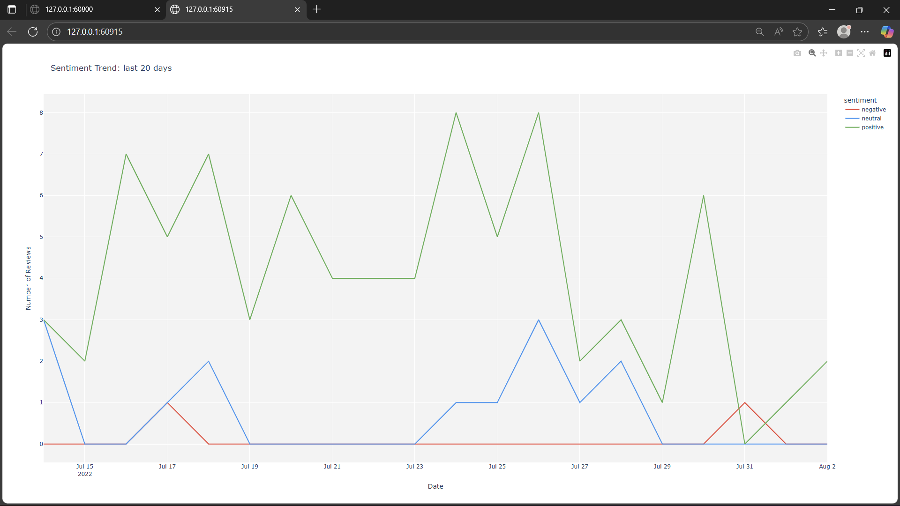
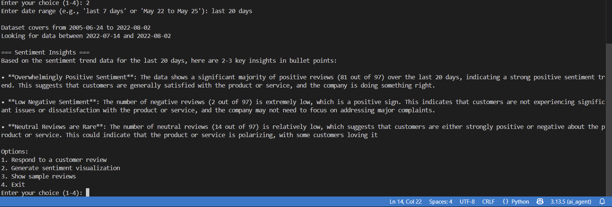
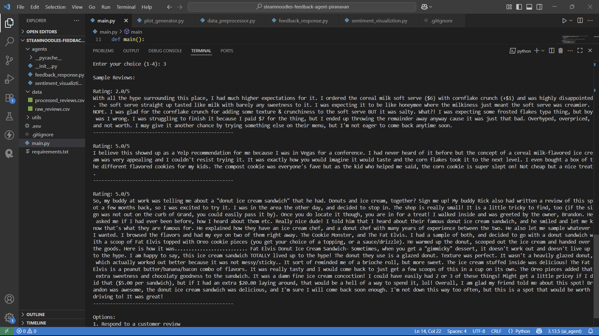

# SteamNoodles Feedback Agents — Piranavan

**University:** University of Moratuwa  
**Year:** 3rd Year  

---

## 📌 Project Summary

This project implements a **multi-agent AI framework** for **SteamNoodles**, a restaurant chain, to automate and personalize customer feedback analysis using modern AI techniques.

- **Agent 1: Feedback Response Agent**  
  Analyzes individual customer reviews, determines sentiment using **Groq LLM**, and generates a short, polite, and context-aware automated reply.

- **Agent 2: Sentiment Visualization Agent**  
  Generates dynamic sentiment trend plots over user-specified date ranges, showing counts of positive, neutral, and negative reviews per day.

The agents use a **Kaggle restaurant review dataset** for demonstration.

---

## 📂 Dataset

- Source: [Kaggle Restaurant Reviews Dataset](https://www.kaggle.com/datasets/farukalam/yelp-restaurant-reviews)  
- After preprocessing, important columns are:
  - `Review_Text` — Customer feedback text  
  - `Sentiment` — Sentiment label (Positive, Neutral, Negative)  
  - `Date` — Datetime of review submission  
  - `Rating` — Customer rating  

---

## ⚙️ Setup Instructions

1. **Clone this repository**
   ```bash
   [git clone https://github.com/Piranavan25/Restaurant-review-agent.git](https://github.com/Piranavan25/Steamnoodles-feedback-agent-Piranavan.git)
   cd Restaurant-review-agent
   ```

2. **Create and activate virtual environment**
   ```bash
   python -m venv venv
   source venv/bin/activate   # Linux/macOS
   venv\Scripts\activate      # Windows
   ```

3. **Install dependencies**
   ```bash
   pip install -r requirements.txt
   ```

4. **Add your Groq API Key**
   Create a `.env` file in the root folder:
   ```bash
   GROQ_API_KEY=your_groq_api_key_here
   ```

5. **Place dataset**
   Download the dataset and place it in the `data/` folder.

---

## ▶️ How to Run

Run the main program:
```bash
python main.py
```

You will see an interactive menu:
```
Beyond Flavours Feedback Agent System
Preprocessing data...

=== Initial Data ===
Total rows: 19896
Columns: ['Yelp URL', 'Rating', 'Date', 'Review Text']
...

Options:
1. Respond to a customer review
2. Generate sentiment visualization
3. Show sample reviews
4. Exit
Enter your choice (1-4):
```

### Menu Options Explained

| Option | Description |
|--------|-------------|
| **1** | **Respond to a customer review** - Randomly Takes a review from the preprocessed_review.csv, detects sentiment using AI, and generates a polite reply |
| **2** | **Generate sentiment visualization** - Creates daily sentiment plots for a date range (see example below) |
| **3** | **Show sample reviews** - Displays dataset samples for reference |
| **4** | **Exit program** - Terminates the application |

---

## 🖼️ Demo Screenshots

### Main Menu


### Option 1: AI-Generated Response


### Option 2: Sentiment Analysis


### Option Selection


### Option Selection


---

## 📚 Dependencies

- Python 3.8+
- Groq API
- Pandas
- python-dotenv

See `requirements.txt` for full list.

---

